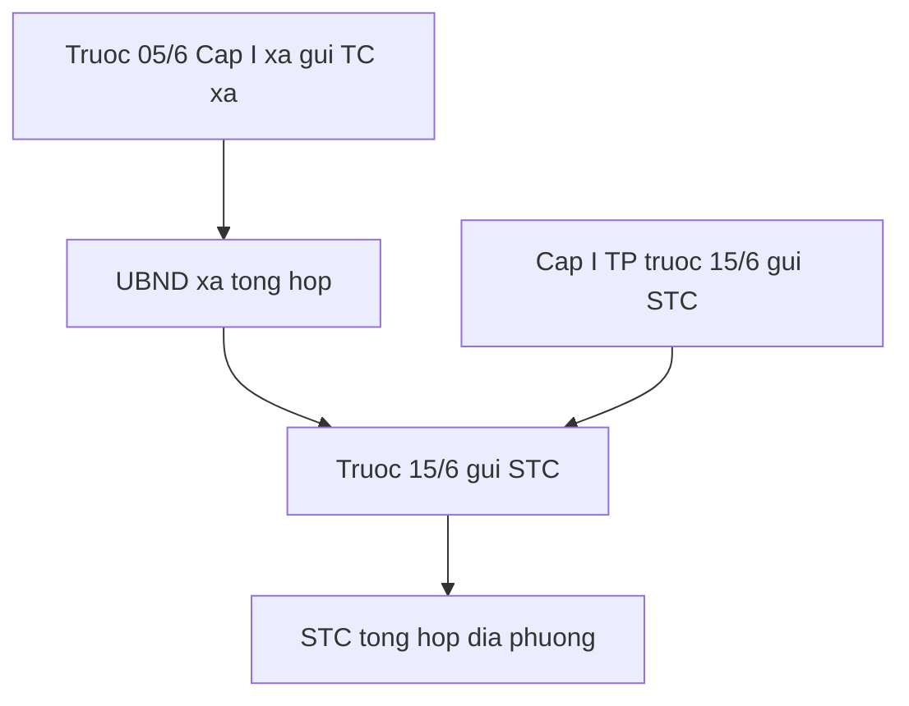

# quytrinh — 71/2026/QĐ-UBND

Lập DT cấp I Đà Nẵng. TBox: [[02-TAILIEU/ontology|ontology]]. Cùng thư mục: [[04-Vanbanquydinh/Da_Nang/Quyet_dinh_UBND/2026/71-2026-QĐ-UBND/Thucthe|Thucthe]] · [[04-Vanbanquydinh/Da_Nang/Quyet_dinh_UBND/2026/71-2026-QĐ-UBND/Quanhe|Quanhe]] · [[04-Vanbanquydinh/Da_Nang/Quyet_dinh_UBND/2026/71-2026-QĐ-UBND/quytrinh|quytrinh]] · [[04-Vanbanquydinh/Da_Nang/Quyet_dinh_UBND/2026/71-2026-QĐ-UBND/index|71/2026/QĐ-UBND]] · [[04-Vanbanquydinh/Da_Nang/Quyet_dinh_UBND/2026/71-2026-QĐ-UBND/toan-van|toàn văn]].

QĐ 71 **có** thời hạn lập–gửi–báo cáo–QT cấp I trên địa bàn Đà Nẵng. Không thay hạn quyết định / giao của [[04-Vanbanquydinh/TW/Luat/2025/89-2025-QH15/quytrinh|quytrinh Luật 89]] / [[04-Vanbanquydinh/TW/Nghi_dinh/2026/73-2026-NĐ-CP/quytrinh|NĐ 73]] (HĐND tỉnh trước 10/12; HĐND xã +10 ngày; UBND giao +5 ngày LV; xong trước 31/12).

## P:lap-gui-du-toan-da-nang

- rdf:type: QuyTrinh
- rdfs:label: Lập và gửi dự toán cấp I — Đà Nẵng
- governs: E:DuToan, E:LichLapGuiDuToan-DaNang
- hasAgent: E:DonViDuToanCapI-DaNang, E:CoQuanTaiChinhCapXa, E:UBNDXa, E:SoTaiChinh
- source: [[04-Vanbanquydinh/Da_Nang/Quyet_dinh_UBND/2026/71-2026-QĐ-UBND/toan-van|QĐ 71/2026 Điều 3]]–Điều 4
- hasDeadline: 05/6 (cấp I xã → TC xã) → 15/6 (UBND xã / cấp I TP → STC)
- precedes: P:lap-giao-du-toan

1. **Cấp I xã / quỹ ngoài NS cấp xã.** Chậm nhất 05/6: lập DT thu–chi (chi tiết ĐT / TX theo lĩnh vực, theo từng ĐVSDNS), gửi cơ quan tài chính cấp xã.
2. **UBND xã + cấp I TP.** Chậm nhất 15/6: gửi STC cùng mức chi tiết. Trễ 15/6 = đứt chuỗi tổng hợp tỉnh.
3. **Thuyết minh phân bổ.** Cấp I gửi TC cùng cấp mẫu 37.1–46.4 Phụ lục I TT 26 + văn bản căn cứ số giao từng ĐVSDNS (Điều 4).

## P:bao-cao-chap-hanh-qt-cap-i-da-nang

- rdf:type: QuyTrinh
- rdfs:label: Báo cáo chấp hành và quyết toán cấp I — Đà Nẵng
- governs: E:QuyetToan, E:DuToanChiConLaiCuaCapNganSach
- hasAgent: E:UBNDXa, E:CoQuanTaiChinhCapXa, E:SoTaiChinh, E:DonViDuToanCapI-DaNang
- source: [[04-Vanbanquydinh/Da_Nang/Quyet_dinh_UBND/2026/71-2026-QĐ-UBND/toan-van|QĐ 71/2026 Điều 5]]–Điều 7
- hasDeadline: ngày 10 quý sau (báo cáo quý); trước 10/3 (tăng thu / DT còn lại); trước 20/02 (QT cấp I xã); trước 31/3 (QT cấp I TP)
- precedes: P:quyet-toan-dia-phuong

1. **Báo cáo quý.** TC xã / STC → UBND cùng cấp tình hình thu–chi; TC xã → STC tình hình bổ sung có mục tiêu. Hạn: ngày 10 tháng đầu quý sau (Điều 6).
2. **Tăng thu / DT chi còn lại năm trước.** UBND xã → STC trước 10/3, Mẫu 01 phụ lục QĐ 71 (Điều 5).
3. **QT cấp I.** NS xã: trước 20/02 năm sau gửi TC xã. NS TP: trước 31/3 gửi STC (Điều 7).

## Liên kết

- [[04-Vanbanquydinh/Da_Nang/Quyet_dinh_UBND/2026/71-2026-QĐ-UBND/Thucthe|Thucthe]] · [[04-Vanbanquydinh/Da_Nang/Quyet_dinh_UBND/2026/71-2026-QĐ-UBND/Quanhe|Quanhe]] · [[04-Vanbanquydinh/Da_Nang/Quyet_dinh_UBND/2026/71-2026-QĐ-UBND/quytrinh|quytrinh]]
- TBox: [[02-TAILIEU/ontology|ontology]] · Hub VB: [[04-Vanbanquydinh/index|Vanbanquydinh]]
