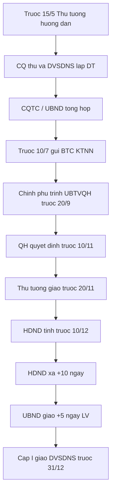
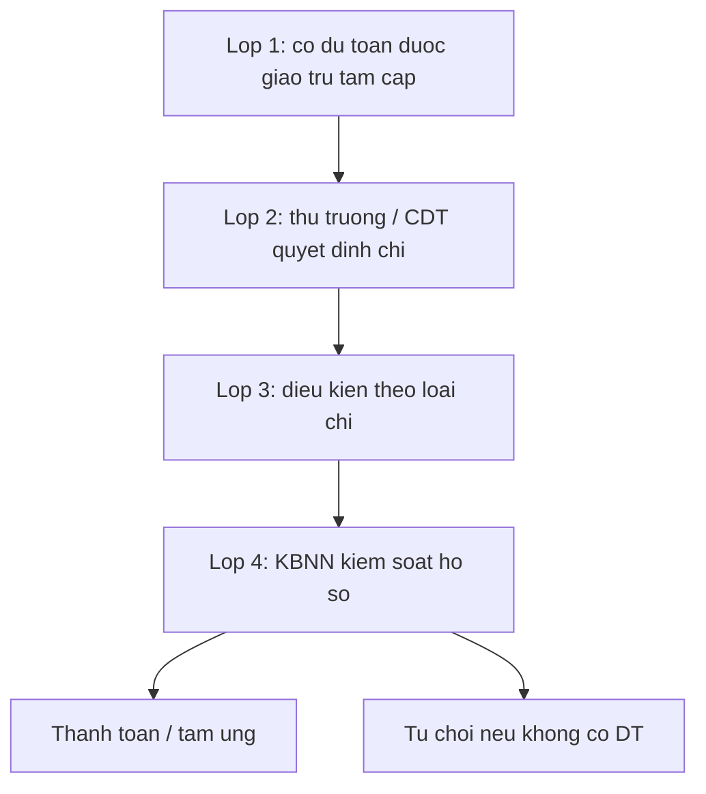
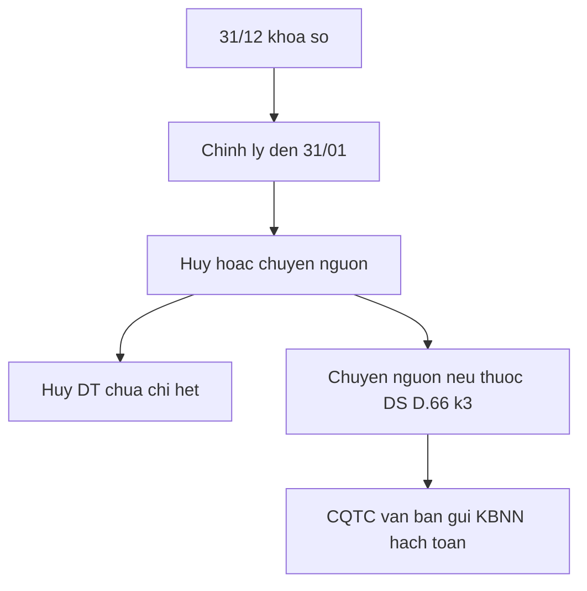
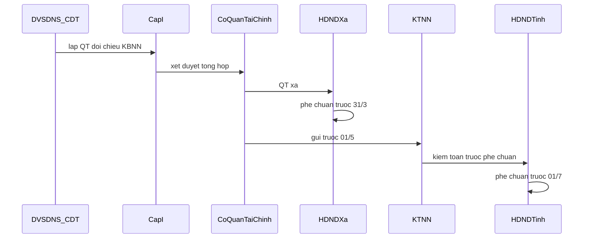

# quytrinh — 73/2026/NĐ-CP

Chi tiết Luật NSNN. TBox: [[02-TAILIEU/ontology|ontology]]. Cùng thư mục: [[04-Vanbanquydinh/TW/Nghi_dinh/2026/73-2026-NĐ-CP/Thucthe|Thucthe]] · [[04-Vanbanquydinh/TW/Nghi_dinh/2026/73-2026-NĐ-CP/Quanhe|Quanhe]] · [[04-Vanbanquydinh/TW/Nghi_dinh/2026/73-2026-NĐ-CP/quytrinh|quytrinh]] · [[04-Vanbanquydinh/TW/Nghi_dinh/2026/73-2026-NĐ-CP/index|73/2026/NĐ-CP]] · [[04-Vanbanquydinh/TW/Nghi_dinh/2026/73-2026-NĐ-CP/toan-van|toàn văn]].

## P:lap-giao-du-toan

- rdf:type: QuyTrinh
- rdfs:label: Lập, quyết định và giao dự toán ngân sách nhà nước
- governs: E:DuToan
- hasAgent: E:ThuTuongChinhPhu, E:BoTaiChinh, E:CoQuanThuNganSach, E:DonViSuDungNganSach, E:DonViDuToanCapI, E:UBNDCacCap, E:HDNDTinh, E:HDNDXa, E:KhoBacNhaNuoc, E:KiemToanNhaNuoc, E:QuocHoi
- source: [[04-Vanbanquydinh/TW/Luat/2025/89-2025-QH15/DieudiemDanchieu/Dieu-46|Luật 89 Điều 46]]–[[04-Vanbanquydinh/TW/Luat/2025/89-2025-QH15/DieudiemDanchieu/Dieu-52|52]]; NĐ 73 Điều 12–15, 17, 19
- hasDeadline: 15/5 → 10/7 → 20/9 → 10/11 → 20/11 → 10/12 (HĐND tỉnh) → +10 ngày (HĐND xã) → +5 ngày LV (UBND giao) → 31/12

1. **Hướng dẫn khung.** Trước 15/5 Thủ tướng ban hành quy định xây dựng KH KT-XH và DT năm sau; BTC hướng dẫn tiếp.
2. **Lập từ cơ sở.** Cơ quan thu lập DT thu gửi cơ quan tài chính (NĐ 73 Đ.12). ĐVSDNS lập DT thu–chi gửi cấp trên; cấp I gửi cơ quan tài chính cùng cấp (NĐ 73 Đ.13; Luật 89 Đ.47).
3. **Tổng hợp địa phương.** TC xã → UBND xã → Thường trực HĐND xã; UBND xã gửi UBND tỉnh. Sở TC tổng hợp → UBND tỉnh gửi BTC, KTNN (NĐ 73 Đ.14).
4. **Nộp TW.** Trước 10/7 bộ TW và UBND tỉnh gửi DT năm sau cho BTC, KTNN (NĐ 73 Đ.15 k3).
5. **Trình Quốc hội.** Chính phủ trình UBTVQH trước 20/9; Quốc hội quyết định trước 10/11 (Luật 89 Đ.46 k2–k4).
6. **Giao DT.** Thủ tướng trước 20/11; BTC giao chi tiết trong 05 ngày LV; HĐND tỉnh trước 10/12; HĐND xã trong 10 ngày sau; UBND giao trong 05 ngày LV (Đ.46 k5–k7).
7. **Phân bổ đến ĐVSDNS.** Cấp I phân bổ, gửi TC cùng cấp và KBNN; hoàn thành trước 31/12 (Đ.51–52).

## P:chap-hanh-chi-bon-lop

- rdf:type: QuyTrinh
- rdfs:label: Chấp hành chi ngân sách — bốn lớp kiểm soát
- governs: E:ChiThuongXuyen, E:ChiDauTuPhatTrien
- hasAgent: E:ThuTruongDonVi, E:ChuDauTu, E:KhoBacNhaNuoc, E:CoQuanTaiChinh
- source: [[04-Vanbanquydinh/TW/Luat/2025/89-2025-QH15/DieudiemDanchieu/Dieu-12|Luật 89 Điều 12]] k2; Đ.8 k4; Đ.53; NĐ 73 Đ.21; [[04-Vanbanquydinh/TW/Thong_tu/2026/26-2026-TT-BTC/DieudiemDanchieu/Dieu-15|TT 26 Điều 15]]
- hasDeadline: Chi/tạm ứng trong DT năm chậm nhất 31/12; nộp hồ sơ rút DT đến KBNN chậm nhất 30/12; chỉnh lý QT: chậm nhất 02 ngày LV trước 31/01
- precedes: P:thanh-toan-chi-thuong-xuyen-kbnn

1. **Lớp 1 — Dự toán.** Khoản chi đã có trong DT được giao, trừ tạm cấp Đ.53.
2. **Lớp 2 — Quyết định chi.** Thủ trưởng ĐVSDNS, chủ đầu tư hoặc người được ủy quyền quyết định chi.
3. **Lớp 3 — Điều kiện theo loại.** (a) chi ĐTPT theo Luật ĐTC; (b) chi TX đúng chế độ–tiêu chuẩn–định mức hoặc QCTN nếu tự chủ; (c) chi DTQG theo pháp luật DTQG; (d) gói thầu theo pháp luật đấu thầu; (đ) đặt hàng theo giá do cấp có thẩm quyền ban hành.
4. **Lớp 4 — Kiểm soát KBNN.** Đối chiếu DT, thanh toán hoặc tạm ứng; từ chối nếu không có DT (NĐ 73 Đ.21 k2). Nhánh tạm cấp: lương/nghiệp vụ phí theo đề nghị đơn vị; sau khi có DT thì thu hồi tạm cấp.

## P:su-dung-du-phong

- rdf:type: QuyTrinh
- rdfs:label: Sử dụng dự phòng ngân sách nhà nước
- governs: E:DuPhongNganSachNhaNuoc
- hasAgent: E:ThuTuongChinhPhu, E:UBNDCacCap, E:BoTaiChinh, E:CoQuanTaiChinh
- source: [[04-Vanbanquydinh/TW/Luat/2025/89-2025-QH15/DieudiemDanchieu/Dieu-10|Luật 89 Điều 10]]; NĐ 73 Điều 25
- hasDeadline: Báo cáo sử dụng dự phòng hằng quý, chậm nhất ngày 20 sau ngày kết thúc quý

1. **Phát sinh nhiệm vụ đúng mục đích.** Thiên tai, thảm họa, dịch bệnh, cứu đói; QP-AN; chi DTQG; đối ngoại đột xuất; chia sẻ giảm DT dự án PPP; nhiệm vụ cần thiết chưa có DT; hỗ trợ cấp dưới / địa phương khác (Đ.10 k2).
2. **Đề xuất.** Bộ/cơ quan TW hoặc đơn vị địa phương lập đề xuất bổ sung DT kèm thuyết minh.
3. **Thẩm định và quyết định.** NSTW: BTC trình Thủ tướng. NS địa phương: cơ quan TC trình UBND cùng cấp.
4. **Giao và phân bổ.** Sau khi bổ sung DT, cấp I giao theo Đ.51–52. CT/DA ngoài KHĐT công trung hạn → NĐ 73 Đ.27.
5. **Báo cáo.** BTC → Chính phủ → UBTVQH hằng quý; UBND → Thường trực HĐND và HĐND kỳ gần nhất.

## P:xu-ly-cuoi-nam

- rdf:type: QuyTrinh
- rdfs:label: Khóa sổ và xử lý thu, chi cuối năm / chuyển nguồn
- governs: E:KhoaSoKeToan, E:ChuyenNguon
- hasAgent: E:DonViSuDungNganSach, E:ChuDauTu, E:CoQuanThuNganSach, E:CoQuanTaiChinh, E:KhoBacNhaNuoc
- source: [[04-Vanbanquydinh/TW/Luat/2025/89-2025-QH15/DieudiemDanchieu/Dieu-66|Luật 89 Điều 66]]; NĐ 73 Điều 30–31; TT 26 Điều 19
- hasDeadline: 31/12 khóa sổ; chỉnh lý đến 31/01; đối chiếu dư với KBNN chậm nhất 10/02; nộp lại tạm ứng không chuyển nguồn trước 15/02; KBNN báo cáo TC số dư chuyển nguồn chậm nhất 20/02

1. **Khóa sổ 31/12.** Các cơ quan liên quan thu–chi khóa sổ kế toán.
2. **Chỉnh lý đến 31/01.** Hạch toán chứng từ đang luân chuyển phát sinh ≤ 31/12; chi tạm ứng đã đủ điều kiện; điều chỉnh sai sót. Thu năm trước nộp từ 01/01 năm sau vào thu năm sau.
3. **Hủy vs chuyển nguồn.** DT chưa chi hết phải hủy, trừ danh mục Đ.66 k3 / NĐ 73 Đ.31 k1 (bổ sung sau 30/9, ĐTC kéo dài, CTMTQG, hợp đồng/đấu thầu xong trước 31/12, lương–ASXH, tự chủ, KHCN, DTQG, viện trợ, hoàn trả theo KTNN/thanh tra).
4. **Xử lý số dư.** Tạm ứng được chuyển nguồn → chuyển năm sau thu hồi; không chuyển → nộp NS trước 15/02.
5. **Tăng thu / DT chi còn lại.** Nếu cấp có thẩm quyền đã quyết định dùng vào năm sau thì được chuyển nguồn (Đ.66 k4).
6. **Hạch toán.** Cơ quan tài chính có văn bản gửi KBNN để hạch toán chi chuyển nguồn năm trước / thu năm sau.

## P:quyet-toan-dia-phuong

- rdf:type: QuyTrinh
- rdfs:label: Thời hạn và trình tự quyết toán ngân sách địa phương
- governs: E:QuyetToan, E:NganSachDiaPhuong
- hasAgent: E:DonViSuDungNganSach, E:DonViDuToanCapI, E:CoQuanTaiChinh, E:UBNDCacCap, E:HDNDXa, E:HDNDTinh, E:KiemToanNhaNuoc, E:BoTaiChinh
- source: [[04-Vanbanquydinh/TW/Luat/2025/89-2025-QH15/DieudiemDanchieu/Dieu-71|Luật 89 Điều 71]]; NĐ 73 Điều 32 k5–k6; Đ.68–70
- hasDeadline: UBND xã xin ý kiến Thường trực HĐND trước 10/3; HĐND xã phê chuẩn trước 31/3; UBND tỉnh gửi BTC–KTNN trước 01/5; HĐND tỉnh phê chuẩn trước 01/7

1. **Lập QT đơn vị.** ĐVSDNS/CĐT lập QT, đối chiếu xác nhận KBNN (Đ.67 k3, Đ.68).
2. **Xét duyệt.** Cấp trên trực tiếp xét duyệt, thông báo QT (Đ.69).
3. **Tổng hợp cấp I → cơ quan TC.** Cấp I gửi TC cùng cấp; TC kiểm tra khớp KBNN (Đ.70).
4. **QT xã.** UBND xã lập QT, xin ý kiến Thường trực HĐND trước 10/3, HĐND xã phê chuẩn trước 31/3, gửi UBND tỉnh trong 05 ngày LV.
5. **QT tỉnh.** Sở TC tổng hợp, UBND tỉnh gửi BTC và **KTNN trước 01/5** (kiểm toán trước khi HĐND tỉnh xem xét — Đ.73 k2).
6. **Phê chuẩn tỉnh.** HĐND tỉnh phê chuẩn trước 01/7; gửi BTC–KTNN QT đã phê chuẩn trước 05/7. Nếu chưa chuẩn, trình lại chậm nhất 10 ngày LV.

## P:quyet-toan-nsnn

- rdf:type: QuyTrinh
- rdfs:label: Thời hạn và trình tự quyết toán ngân sách nhà nước
- governs: E:QuyetToan, E:NganSachNhaNuoc
- hasAgent: E:DonViDuToanCapI, E:UBNDTinh, E:BoTaiChinh, E:ChinhPhu, E:KiemToanNhaNuoc, E:UyBanThuongVuQuocHoi, E:UyBanKinhTeVaTaiChinhQH, E:QuocHoi
- source: [[04-Vanbanquydinh/TW/Luat/2025/89-2025-QH15/DieudiemDanchieu/Dieu-72|Luật 89 Điều 72]]–[[04-Vanbanquydinh/TW/Luat/2025/89-2025-QH15/DieudiemDanchieu/Dieu-73|73]]; NĐ 73 Điều 32 k7
- hasDeadline: Cấp I TW gửi BTC–KTNN trước 05/7; UBND tỉnh gửi QT đã phê chuẩn trước 05/7; BTC lập QT trình Chính phủ và gửi KTNN chậm nhất 15/8; Chính phủ báo cáo UBTVQH chậm nhất 20/9; Quốc hội phê chuẩn chậm nhất 12 tháng sau hết năm NS
- precedes: P:quyet-toan-dia-phuong

1. **Tập hợp đầu vào.** QT cấp I NSTW (05/7) + QT địa phương đã HĐND tỉnh phê chuẩn (05/7).
2. **Tổng hợp quốc gia.** BTC lập báo cáo QT NSNN, trình Chính phủ, gửi KTNN ≤ 15/8.
3. **Kiểm toán bắt buộc.** KTNN kiểm toán **trước** khi trình Quốc hội phê chuẩn (Đ.73 k1).
4. **UBTVQH cho ý kiến.** Chính phủ báo cáo ≤ 20/9, tiếp thu, hoàn chỉnh.
5. **Thẩm tra.** Ủy ban Kinh tế và Tài chính QH chủ trì thẩm tra (Đ.21 k2, Đ.72 k6).
6. **Phê chuẩn.** Quốc hội phê chuẩn chậm nhất 12 tháng sau năm NS.

## Liên kết

- [[04-Vanbanquydinh/TW/Nghi_dinh/2026/73-2026-NĐ-CP/Thucthe|Thucthe]] · [[04-Vanbanquydinh/TW/Nghi_dinh/2026/73-2026-NĐ-CP/Quanhe|Quanhe]] · [[04-Vanbanquydinh/TW/Nghi_dinh/2026/73-2026-NĐ-CP/quytrinh|quytrinh]]
- TBox: [[02-TAILIEU/ontology|ontology]] · Hub VB: [[04-Vanbanquydinh/index|Vanbanquydinh]]
