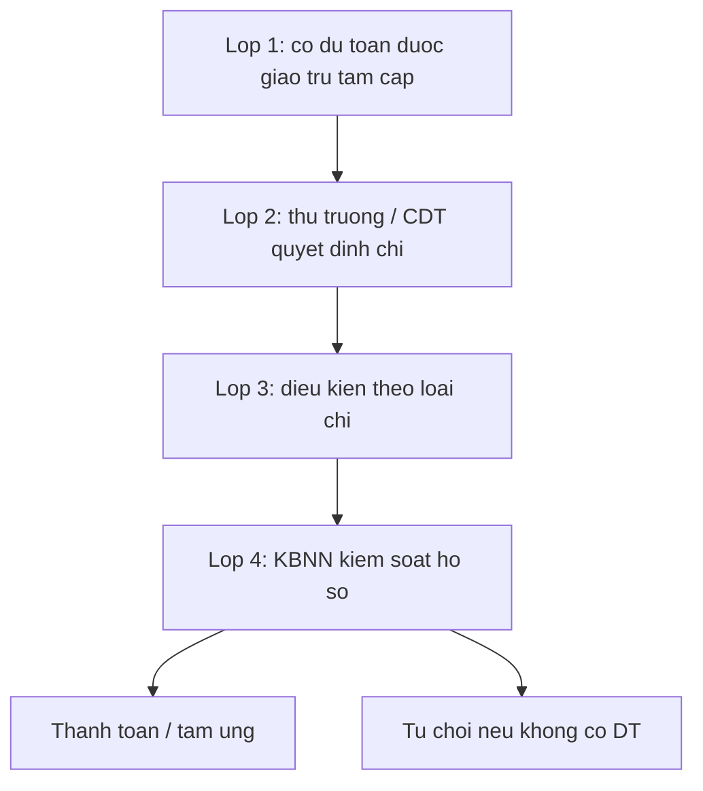
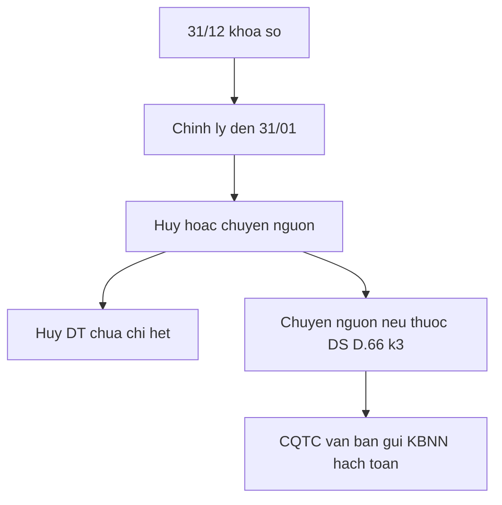

# quytrinh — 26/2026/TT-BTC

Hướng dẫn NĐ 73 / Luật 89. TBox: [[02-TAILIEU/ontology|ontology]]. Cùng thư mục: [[04-Vanbanquydinh/TW/Thong_tu/2026/26-2026-TT-BTC/Thucthe|Thucthe]] · [[04-Vanbanquydinh/TW/Thong_tu/2026/26-2026-TT-BTC/Quanhe|Quanhe]] · [[04-Vanbanquydinh/TW/Thong_tu/2026/26-2026-TT-BTC/quytrinh|quytrinh]] · [[04-Vanbanquydinh/TW/Thong_tu/2026/26-2026-TT-BTC/index|26/2026/TT-BTC]] · [[04-Vanbanquydinh/TW/Thong_tu/2026/26-2026-TT-BTC/toan-van|toàn văn]].

## P:chap-hanh-chi-bon-lop

- rdf:type: QuyTrinh
- rdfs:label: Chấp hành chi ngân sách — bốn lớp kiểm soát
- governs: E:ChiThuongXuyen, E:ChiDauTuPhatTrien
- hasAgent: E:ThuTruongDonVi, E:ChuDauTu, E:KhoBacNhaNuoc, E:CoQuanTaiChinh
- source: [[04-Vanbanquydinh/TW/Luat/2025/89-2025-QH15/DieudiemDanchieu/Dieu-12|Luật 89 Điều 12]] k2; Đ.8 k4; Đ.53; NĐ 73 Đ.21; [[04-Vanbanquydinh/TW/Thong_tu/2026/26-2026-TT-BTC/DieudiemDanchieu/Dieu-15|TT 26 Điều 15]]
- hasDeadline: Chi/tạm ứng trong DT năm chậm nhất 31/12; nộp hồ sơ rút DT đến KBNN chậm nhất 30/12; chỉnh lý QT: chậm nhất 02 ngày LV trước 31/01
- precedes: P:thanh-toan-chi-thuong-xuyen-kbnn

1. **Lớp 1 — Dự toán.** Khoản chi đã có trong DT được giao, trừ tạm cấp Đ.53.
2. **Lớp 2 — Quyết định chi.** Thủ trưởng ĐVSDNS, chủ đầu tư hoặc người được ủy quyền quyết định chi.
3. **Lớp 3 — Điều kiện theo loại.** (a) chi ĐTPT theo Luật ĐTC; (b) chi TX đúng chế độ–tiêu chuẩn–định mức hoặc QCTN nếu tự chủ; (c) chi DTQG theo pháp luật DTQG; (d) gói thầu theo pháp luật đấu thầu; (đ) đặt hàng theo giá do cấp có thẩm quyền ban hành.
4. **Lớp 4 — Kiểm soát KBNN.** Đối chiếu DT, thanh toán hoặc tạm ứng; từ chối nếu không có DT (NĐ 73 Đ.21 k2). Nhánh tạm cấp: lương/nghiệp vụ phí theo đề nghị đơn vị; sau khi có DT thì thu hồi tạm cấp.

## P:xu-ly-cuoi-nam

- rdf:type: QuyTrinh
- rdfs:label: Khóa sổ và xử lý thu, chi cuối năm / chuyển nguồn
- governs: E:KhoaSoKeToan, E:ChuyenNguon
- hasAgent: E:DonViSuDungNganSach, E:ChuDauTu, E:CoQuanThuNganSach, E:CoQuanTaiChinh, E:KhoBacNhaNuoc
- source: [[04-Vanbanquydinh/TW/Luat/2025/89-2025-QH15/DieudiemDanchieu/Dieu-66|Luật 89 Điều 66]]; NĐ 73 Điều 30–31; TT 26 Điều 19
- hasDeadline: 31/12 khóa sổ; chỉnh lý đến 31/01; đối chiếu dư với KBNN chậm nhất 10/02; nộp lại tạm ứng không chuyển nguồn trước 15/02; KBNN báo cáo TC số dư chuyển nguồn chậm nhất 20/02

1. **Khóa sổ 31/12.** Các cơ quan liên quan thu–chi khóa sổ kế toán.
2. **Chỉnh lý đến 31/01.** Hạch toán chứng từ đang luân chuyển phát sinh ≤ 31/12; chi tạm ứng đã đủ điều kiện; điều chỉnh sai sót. Thu năm trước nộp từ 01/01 năm sau vào thu năm sau.
3. **Hủy vs chuyển nguồn.** DT chưa chi hết phải hủy, trừ danh mục Đ.66 k3 / NĐ 73 Đ.31 k1 (bổ sung sau 30/9, ĐTC kéo dài, CTMTQG, hợp đồng/đấu thầu xong trước 31/12, lương–ASXH, tự chủ, KHCN, DTQG, viện trợ, hoàn trả theo KTNN/thanh tra).
4. **Xử lý số dư.** Tạm ứng được chuyển nguồn → chuyển năm sau thu hồi; không chuyển → nộp NS trước 15/02.
5. **Tăng thu / DT chi còn lại.** Nếu cấp có thẩm quyền đã quyết định dùng vào năm sau thì được chuyển nguồn (Đ.66 k4).
6. **Hạch toán.** Cơ quan tài chính có văn bản gửi KBNN để hạch toán chi chuyển nguồn năm trước / thu năm sau.

## Liên kết

- [[04-Vanbanquydinh/TW/Thong_tu/2026/26-2026-TT-BTC/Thucthe|Thucthe]] · [[04-Vanbanquydinh/TW/Thong_tu/2026/26-2026-TT-BTC/Quanhe|Quanhe]] · [[04-Vanbanquydinh/TW/Thong_tu/2026/26-2026-TT-BTC/quytrinh|quytrinh]]
- TBox: [[02-TAILIEU/ontology|ontology]] · Hub VB: [[04-Vanbanquydinh/index|Vanbanquydinh]]
