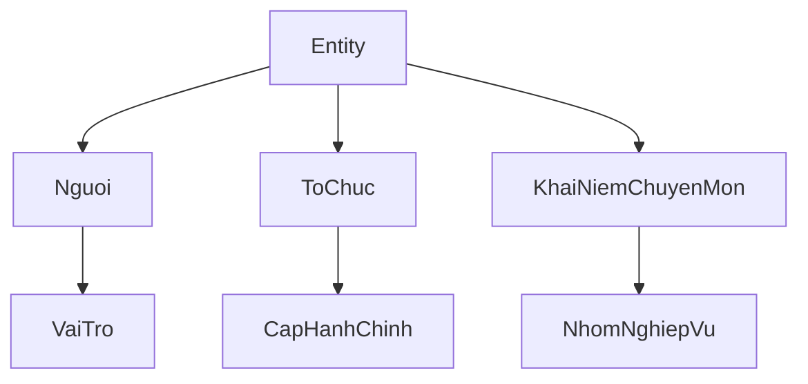

# Ontology Vanbanquydinh

Lớp nghiên cứu: TBox (trang này, [[TAILIEU/ontology|ontology]]) + **ABox trong từng thư mục văn bản** [[Vanbanquydinh/index|Vanbanquydinh]]. Không lưu `Thucthe.md` / `Quanhe.md` / `quytrinh.md` tập trung. Không thay YAML corpus (`onto_class: VANBAN_QUYPHAM` / `Dieu` giữ nguyên).

Mỗi số hiệu = một thư mục; trong đó:

- `Thucthe.md` — thực thể (`E:`)
- `Quanhe.md` — triple / quy tắc (`R:`)
- `quytrinh.md` — trình tự, thời hạn (`P:`)

Wikilink **full path** (64 file cùng tên — không dùng `[[Thucthe]]` trần). Hub gói: [[hub-goi|DANANG_CQ2cap_Kiemtoan]] · Nghiên cứu: [[TIMHIEU/nghien-cuu/index|nghien-cuu]] · So với cẩm nang: [[TIMHIEU/nghien-cuu/ontology-cam-nang|ontology vs 4 buổi]] · Danh mục: [[TAILIEU/danh-muc-van-ban-dan-chieu|danh-muc]].

Canonical Luật NSNN = [[Vanbanquydinh/TW/Luat/2025/89-2025-QH15/index|89/2025/QH15]] ([[Vanbanquydinh/TW/Luat/2025/89-2025-QH15/Thucthe|Thucthe]] · [[Vanbanquydinh/TW/Luat/2025/89-2025-QH15/Quanhe|Quanhe]] · [[Vanbanquydinh/TW/Luat/2025/89-2025-QH15/quytrinh|quytrinh]]). [[Vanbanquydinh/TW/Van_ban_hop_nhat/2026/89-VBHN-VPQH/index|89/VBHN-VPQH]] = `owl:sameAs` (bản hợp nhất cùng số Điều — file ontology là con trỏ, không nhân đôi ID).

## TBox

### Classes

| Class | rdfs:label | Phạm vi |
|-------|------------|---------|
| `Entity` | Thực thể | Gốc |
| `Nguoi` | Người / vai trò | Cá nhân hoặc chức danh có nhiệm vụ, quyền hạn, trách nhiệm |
| `ToChuc` | Tổ chức | Cơ quan, đơn vị, tổ chức được giao nhiệm vụ/quyền hạn |
| `KhaiNiemChuyenMon` | Khái niệm chuyên môn | Thuật ngữ được định nghĩa hoặc là đối tượng của một Điều/khoản |
| `VaiTro` | Vai trò | `rdfs:subClassOf` Nguoi — Chủ tịch UBND, thủ trưởng đơn vị, chủ đầu tư |
| `CapHanhChinh` | Cấp hành chính | TW / tỉnh / xã (sau 01/07/2025) |
| `QuyTrinh` | Quy trình | Trình tự, thời hạn, bước — file `quytrinh.md` trong thư mục từng VB |
| `QuyTac` | Quy tắc nghiệp vụ | Triple có constraint — file `Quanhe.md` trong thư mục từng VB |

`Nguoi` gồm cả **vai trò chức danh** (không chỉ cá nhân tự nhiên): Thủ tướng, Chủ tịch UBND, thủ trưởng đơn vị sử dụng ngân sách, chủ đầu tư.

### Object / annotation properties

| Property | Domain → Range | Nghĩa |
|----------|----------------|-------|
| `rdf:type` | Entity → Class | Phân loại |
| `rdfs:subClassOf` / `rdfs:subPropertyOf` | Class → Class | Phân cấp |
| `rdfs:label` | Entity → Literal | Nhãn tiếng Việt |
| `skos:definition` | Entity → Literal | Một câu định nghĩa |
| `owl:sameAs` | Entity → Entity | 89/2025 ≡ 89-VBHN; alias |
| `definedIn` | Entity → Dieu | Điều/khoản *Giải thích từ ngữ* hoặc khoản định nghĩa |
| `mentionedIn` | Entity → Dieu | Đề cập có vai trò (nhiệm vụ / đối tượng quy tắc) |
| `hasDuty` | Nguoi\|ToChuc → KhaiNiemChuyenMon | Nhiệm vụ |
| `hasAuthority` | Nguoi\|ToChuc → KhaiNiemChuyenMon | Quyền hạn / thẩm quyền |
| `reportsTo` | ToChuc\|Nguoi → ToChuc\|Nguoi | Báo cáo / trình |
| `allocatesTo` | ToChuc → ToChuc | Phân bổ / giao dự toán |
| `mustSatisfy` | KhaiNiemChuyenMon → KhaiNiemChuyenMon | Điều kiện bắt buộc |
| `precedes` | Buoc\|QuyTrinh → Buoc\|QuyTrinh | Thứ tự bước |
| `hasDeadline` | Buoc → Literal | Thời hạn |
| `governs` | VanBan\|Dieu → Entity\|QuyTrinh | Văn bản/Điều điều chỉnh |
| `pheChuan` / `quyetDinh` / `giaoDuToan` | (xem Quanhe của VB) | Predicate nghiệp vụ |
| `khongDuoc` | Entity → Entity | Cấm / ngoài thẩm quyền |
| `kiemTra` | ToChuc → KhaiNiemChuyenMon | Kiểm hồ sơ (KBNN / TC), không duyệt chi thay |
| `giaiNgan` | ToChuc → KhaiNiemChuyenMon | Cửa vốn ĐT qua kho |
| `phanCapThuChi` | ToChuc → KhaiNiemChuyenMon | Phân cấp nguồn thu–nhiệm vụ chi |
| `baoDam` | KhaiNiemChuyenMon → KhaiNiemChuyenMon | Nhiệm vụ chi thuộc cấp nào do cấp đó bảo đảm |

### Quy ước ID

- Thực thể: `E:<SlugAscii>` — ví dụ `E:DonViDuToanCapI`
- Quy tắc: `R:<ChuThe>-<predicate>-<TanNgu>` — ví dụ `R:HDNDXa-pheChuan-QuyetToan`
- Quy trình: `P:<slug>` — ví dụ `P:quyet-toan-ngan-sach-dia-phuong`

Slug: bỏ dấu, PascalCase (E/R) hoặc kebab-case (P). Một thực thể = một ID dù xuất hiện nhiều văn bản; file từng VB chỉ chứa block thuộc `definedIn` / `source` của số hiệu đó (có thể lặp ID khi một Điều dẫn nhiều VB).

### Dẫn chiếu Điều

Khi có file `DieudiemDanchieu/Dieu-NN.md`: wikilink tới file đó, nhãn `Điều N. <tên>` hoặc `Luật 89/2025 Điều N khoản k`. Khi chưa tách: `[[Vanbanquydinh/.../toan-van|số hiệu]]` + số Điều/khoản/điểm.

Không dán toàn Điều. `skos:definition` = một câu.

### Bộ lọc

Ghi (nghiệp vụ, không chỉ glossary):

- *Giải thích từ ngữ*; người/tổ chức có nhiệm vụ–quyền hạn–trách nhiệm–cấm.
- Khái niệm là đối tượng của Điều/khoản định nghĩa **hoặc** quy tắc công chức phải dừng / làm / gửi trước hạn.
- `R:` có `constraint` hành động được + `source` Dieudiem; `P:` khi có `hasDeadline` hoặc chuỗi cửa.
- Overlay 4 buổi cẩm nang để biết *cần block nào* — căn cứ vẫn là Dieudiem / `toan-van`.

Không ghi: danh từ tình cờ (*năm*, *pháp luật*); lặp cùng chủ ngữ trong cùng Điều; nguyên chương / phụ lục; bảng tỷ lệ–định mức–mã nguồn; stub «Chưa tách…»; heading nhóm trống (`### C3.`).

Lớp ngoại vi (Đất đai, Xây dựng, …): *Giải thích từ ngữ* + actor/quy trình giao NSNN–TSC–chi.

Extract lần sau: skill Cursor `extract-ontology-danang` (`.cursor/skills/extract-ontology-danang/` trong repo VBPL) — một số hiệu / lần, không đổ catalog.

## Mục lục 64 văn bản

Mỗi dòng = thư mục số hiệu (cùng chỗ với `toan-van.md` / `index.md`).

- [[Vanbanquydinh/TW/Luat/2025/89-2025-QH15/index|89/2025/QH15]] — Luật NSNN: [[Vanbanquydinh/TW/Luat/2025/89-2025-QH15/Thucthe|Thucthe]] · [[Vanbanquydinh/TW/Luat/2025/89-2025-QH15/Quanhe|Quanhe]] · [[Vanbanquydinh/TW/Luat/2025/89-2025-QH15/quytrinh|quytrinh]]
- [[Vanbanquydinh/TW/Van_ban_hop_nhat/2026/89-VBHN-VPQH/index|89/VBHN-VPQH]] — VBHN Luật NSNN: [[Vanbanquydinh/TW/Van_ban_hop_nhat/2026/89-VBHN-VPQH/Thucthe|Thucthe]] · [[Vanbanquydinh/TW/Van_ban_hop_nhat/2026/89-VBHN-VPQH/Quanhe|Quanhe]] · [[Vanbanquydinh/TW/Van_ban_hop_nhat/2026/89-VBHN-VPQH/quytrinh|quytrinh]]
- [[Vanbanquydinh/TW/Luat/2025/72-2025-QH15/index|72/2025/QH15]] — Luật Tổ chức CQĐP: [[Vanbanquydinh/TW/Luat/2025/72-2025-QH15/Thucthe|Thucthe]] · [[Vanbanquydinh/TW/Luat/2025/72-2025-QH15/Quanhe|Quanhe]] · [[Vanbanquydinh/TW/Luat/2025/72-2025-QH15/quytrinh|quytrinh]]
- [[Vanbanquydinh/TW/Luat/2017/15-2017-QH14/index|15/2017/QH14]] — Luật TSC: [[Vanbanquydinh/TW/Luat/2017/15-2017-QH14/Thucthe|Thucthe]] · [[Vanbanquydinh/TW/Luat/2017/15-2017-QH14/Quanhe|Quanhe]] · [[Vanbanquydinh/TW/Luat/2017/15-2017-QH14/quytrinh|quytrinh]]
- [[Vanbanquydinh/TW/Luat/2024/58-2024-QH15/index|58/2024/QH15]] — Luật Đầu tư công: [[Vanbanquydinh/TW/Luat/2024/58-2024-QH15/Thucthe|Thucthe]] · [[Vanbanquydinh/TW/Luat/2024/58-2024-QH15/Quanhe|Quanhe]] · [[Vanbanquydinh/TW/Luat/2024/58-2024-QH15/quytrinh|quytrinh]]
- [[Vanbanquydinh/TW/Luat/2025/145-2025-QH15/index|145/2025/QH15]] — Luật Dự trữ quốc gia: [[Vanbanquydinh/TW/Luat/2025/145-2025-QH15/Thucthe|Thucthe]] · [[Vanbanquydinh/TW/Luat/2025/145-2025-QH15/Quanhe|Quanhe]] · [[Vanbanquydinh/TW/Luat/2025/145-2025-QH15/quytrinh|quytrinh]]
- [[Vanbanquydinh/TW/Luat/2020/64-2020-QH14/index|64/2020/QH14]] — Luật sửa TSC: [[Vanbanquydinh/TW/Luat/2020/64-2020-QH14/Thucthe|Thucthe]] · [[Vanbanquydinh/TW/Luat/2020/64-2020-QH14/Quanhe|Quanhe]] · [[Vanbanquydinh/TW/Luat/2020/64-2020-QH14/quytrinh|quytrinh]]
- [[Vanbanquydinh/TW/Luat/2022/07-2022-QH15/index|07/2022/QH15]] — Luật sửa TSC: [[Vanbanquydinh/TW/Luat/2022/07-2022-QH15/Thucthe|Thucthe]] · [[Vanbanquydinh/TW/Luat/2022/07-2022-QH15/Quanhe|Quanhe]] · [[Vanbanquydinh/TW/Luat/2022/07-2022-QH15/quytrinh|quytrinh]]
- [[Vanbanquydinh/TW/Luat/2023/24-2023-QH15/index|24/2023/QH15]] — Luật sửa TSC: [[Vanbanquydinh/TW/Luat/2023/24-2023-QH15/Thucthe|Thucthe]] · [[Vanbanquydinh/TW/Luat/2023/24-2023-QH15/Quanhe|Quanhe]] · [[Vanbanquydinh/TW/Luat/2023/24-2023-QH15/quytrinh|quytrinh]]
- [[Vanbanquydinh/TW/Luat/2024/43-2024-QH15/index|43/2024/QH15]] — Luật sửa TSC: [[Vanbanquydinh/TW/Luat/2024/43-2024-QH15/Thucthe|Thucthe]] · [[Vanbanquydinh/TW/Luat/2024/43-2024-QH15/Quanhe|Quanhe]] · [[Vanbanquydinh/TW/Luat/2024/43-2024-QH15/quytrinh|quytrinh]]
- [[Vanbanquydinh/TW/Luat/2024/56-2024-QH15/index|56/2024/QH15]] — Luật sửa một số luật (TSC): [[Vanbanquydinh/TW/Luat/2024/56-2024-QH15/Thucthe|Thucthe]] · [[Vanbanquydinh/TW/Luat/2024/56-2024-QH15/Quanhe|Quanhe]] · [[Vanbanquydinh/TW/Luat/2024/56-2024-QH15/quytrinh|quytrinh]]
- [[Vanbanquydinh/TW/Luat/2025/90-2025-QH15/index|90/2025/QH15]] — Luật sửa (TSC / CQĐP): [[Vanbanquydinh/TW/Luat/2025/90-2025-QH15/Thucthe|Thucthe]] · [[Vanbanquydinh/TW/Luat/2025/90-2025-QH15/Quanhe|Quanhe]] · [[Vanbanquydinh/TW/Luat/2025/90-2025-QH15/quytrinh|quytrinh]]
- [[Vanbanquydinh/TW/Luat/2023/22-2023-QH15/index|22/2023/QH15]] — Luật Đấu thầu: [[Vanbanquydinh/TW/Luat/2023/22-2023-QH15/Thucthe|Thucthe]] · [[Vanbanquydinh/TW/Luat/2023/22-2023-QH15/Quanhe|Quanhe]] · [[Vanbanquydinh/TW/Luat/2023/22-2023-QH15/quytrinh|quytrinh]]
- [[Vanbanquydinh/TW/Luat/2015/88-2015-QH13/index|88/2015/QH13]] — Luật Kế toán: [[Vanbanquydinh/TW/Luat/2015/88-2015-QH13/Thucthe|Thucthe]] · [[Vanbanquydinh/TW/Luat/2015/88-2015-QH13/Quanhe|Quanhe]] · [[Vanbanquydinh/TW/Luat/2015/88-2015-QH13/quytrinh|quytrinh]]
- [[Vanbanquydinh/TW/Luat/2025/135-2025-QH15/index|135/2025/QH15]] — Luật Xây dựng: [[Vanbanquydinh/TW/Luat/2025/135-2025-QH15/Thucthe|Thucthe]] · [[Vanbanquydinh/TW/Luat/2025/135-2025-QH15/Quanhe|Quanhe]] · [[Vanbanquydinh/TW/Luat/2025/135-2025-QH15/quytrinh|quytrinh]]
- [[Vanbanquydinh/TW/Luat/2024/31-2024-QH15/index|31/2024/QH15]] — Luật Đất đai: [[Vanbanquydinh/TW/Luat/2024/31-2024-QH15/Thucthe|Thucthe]] · [[Vanbanquydinh/TW/Luat/2024/31-2024-QH15/Quanhe|Quanhe]] · [[Vanbanquydinh/TW/Luat/2024/31-2024-QH15/quytrinh|quytrinh]]
- [[Vanbanquydinh/TW/Nghi_quyet_QH/2025/245-2025-QH15/index|245/2025/QH15]] — NQ dự toán NSNN 2026: [[Vanbanquydinh/TW/Nghi_quyet_QH/2025/245-2025-QH15/Thucthe|Thucthe]] · [[Vanbanquydinh/TW/Nghi_quyet_QH/2025/245-2025-QH15/Quanhe|Quanhe]] · [[Vanbanquydinh/TW/Nghi_quyet_QH/2025/245-2025-QH15/quytrinh|quytrinh]]
- [[Vanbanquydinh/TW/Nghi_quyet_TW/2018/27-NQ-TW/index|27-NQ/TW]] — NQ TW CCTL: [[Vanbanquydinh/TW/Nghi_quyet_TW/2018/27-NQ-TW/Thucthe|Thucthe]] · [[Vanbanquydinh/TW/Nghi_quyet_TW/2018/27-NQ-TW/Quanhe|Quanhe]] · [[Vanbanquydinh/TW/Nghi_quyet_TW/2018/27-NQ-TW/quytrinh|quytrinh]]
- [[Vanbanquydinh/TW/Nghi_quyet_TW/2024/57-NQ-TW/index|57-NQ/TW]] — NQ TW KHCN ĐMST CĐS: [[Vanbanquydinh/TW/Nghi_quyet_TW/2024/57-NQ-TW/Thucthe|Thucthe]] · [[Vanbanquydinh/TW/Nghi_quyet_TW/2024/57-NQ-TW/Quanhe|Quanhe]] · [[Vanbanquydinh/TW/Nghi_quyet_TW/2024/57-NQ-TW/quytrinh|quytrinh]]
- [[Vanbanquydinh/TW/Nghi_dinh/2020/11-2020-NĐ-CP/index|11/2020/NĐ-CP]] — TTHC Kho bạc: [[Vanbanquydinh/TW/Nghi_dinh/2020/11-2020-NĐ-CP/Thucthe|Thucthe]] · [[Vanbanquydinh/TW/Nghi_dinh/2020/11-2020-NĐ-CP/Quanhe|Quanhe]] · [[Vanbanquydinh/TW/Nghi_dinh/2020/11-2020-NĐ-CP/quytrinh|quytrinh]]
- [[Vanbanquydinh/TW/Nghi_dinh/2021/60-2021-NĐ-CP/index|60/2021/NĐ-CP]] — Tự chủ ĐVSNCL: [[Vanbanquydinh/TW/Nghi_dinh/2021/60-2021-NĐ-CP/Thucthe|Thucthe]] · [[Vanbanquydinh/TW/Nghi_dinh/2021/60-2021-NĐ-CP/Quanhe|Quanhe]] · [[Vanbanquydinh/TW/Nghi_dinh/2021/60-2021-NĐ-CP/quytrinh|quytrinh]]
- [[Vanbanquydinh/TW/Nghi_dinh/2022/111-2022-NĐ-CP/index|111/2022/NĐ-CP]] — HĐLĐ CQHC ĐVSN: [[Vanbanquydinh/TW/Nghi_dinh/2022/111-2022-NĐ-CP/Thucthe|Thucthe]] · [[Vanbanquydinh/TW/Nghi_dinh/2022/111-2022-NĐ-CP/Quanhe|Quanhe]] · [[Vanbanquydinh/TW/Nghi_dinh/2022/111-2022-NĐ-CP/quytrinh|quytrinh]]
- [[Vanbanquydinh/TW/Nghi_dinh/2024/73-2024-NĐ-CP/index|73/2024/NĐ-CP]] — Lương cơ sở (cũ): [[Vanbanquydinh/TW/Nghi_dinh/2024/73-2024-NĐ-CP/Thucthe|Thucthe]] · [[Vanbanquydinh/TW/Nghi_dinh/2024/73-2024-NĐ-CP/Quanhe|Quanhe]] · [[Vanbanquydinh/TW/Nghi_dinh/2024/73-2024-NĐ-CP/quytrinh|quytrinh]]
- [[Vanbanquydinh/TW/Nghi_dinh/2025/111-2025-NĐ-CP/index|111/2025/NĐ-CP]] — Sửa NĐ 60 tự chủ: [[Vanbanquydinh/TW/Nghi_dinh/2025/111-2025-NĐ-CP/Thucthe|Thucthe]] · [[Vanbanquydinh/TW/Nghi_dinh/2025/111-2025-NĐ-CP/Quanhe|Quanhe]] · [[Vanbanquydinh/TW/Nghi_dinh/2025/111-2025-NĐ-CP/quytrinh|quytrinh]]
- [[Vanbanquydinh/TW/Nghi_dinh/2025/125-2025-NĐ-CP/index|125/2025/NĐ-CP]] — Phân định thẩm quyền 2 cấp BTC: [[Vanbanquydinh/TW/Nghi_dinh/2025/125-2025-NĐ-CP/Thucthe|Thucthe]] · [[Vanbanquydinh/TW/Nghi_dinh/2025/125-2025-NĐ-CP/Quanhe|Quanhe]] · [[Vanbanquydinh/TW/Nghi_dinh/2025/125-2025-NĐ-CP/quytrinh|quytrinh]]
- [[Vanbanquydinh/TW/Nghi_dinh/2025/127-2025-NĐ-CP/index|127/2025/NĐ-CP]] — Phân cấp QLNN TSC: [[Vanbanquydinh/TW/Nghi_dinh/2025/127-2025-NĐ-CP/Thucthe|Thucthe]] · [[Vanbanquydinh/TW/Nghi_dinh/2025/127-2025-NĐ-CP/Quanhe|Quanhe]] · [[Vanbanquydinh/TW/Nghi_dinh/2025/127-2025-NĐ-CP/quytrinh|quytrinh]]
- [[Vanbanquydinh/TW/Nghi_dinh/2025/150-2025-NĐ-CP/index|150/2025/NĐ-CP]] — CQ chuyên môn UBND: [[Vanbanquydinh/TW/Nghi_dinh/2025/150-2025-NĐ-CP/Thucthe|Thucthe]] · [[Vanbanquydinh/TW/Nghi_dinh/2025/150-2025-NĐ-CP/Quanhe|Quanhe]] · [[Vanbanquydinh/TW/Nghi_dinh/2025/150-2025-NĐ-CP/quytrinh|quytrinh]]
- [[Vanbanquydinh/TW/Nghi_dinh/2025/152-2025-NĐ-CP/index|152/2025/NĐ-CP]] — Thi đua khen thưởng: [[Vanbanquydinh/TW/Nghi_dinh/2025/152-2025-NĐ-CP/Thucthe|Thucthe]] · [[Vanbanquydinh/TW/Nghi_dinh/2025/152-2025-NĐ-CP/Quanhe|Quanhe]] · [[Vanbanquydinh/TW/Nghi_dinh/2025/152-2025-NĐ-CP/quytrinh|quytrinh]]
- [[Vanbanquydinh/TW/Nghi_dinh/2025/173-2025-NĐ-CP/index|173/2025/NĐ-CP]] — HĐ nhiệm vụ công chức: [[Vanbanquydinh/TW/Nghi_dinh/2025/173-2025-NĐ-CP/Thucthe|Thucthe]] · [[Vanbanquydinh/TW/Nghi_dinh/2025/173-2025-NĐ-CP/Quanhe|Quanhe]] · [[Vanbanquydinh/TW/Nghi_dinh/2025/173-2025-NĐ-CP/quytrinh|quytrinh]]
- [[Vanbanquydinh/TW/Nghi_dinh/2025/186-2025-NĐ-CP/index|186/2025/NĐ-CP]] — Chi tiết Luật TSC: [[Vanbanquydinh/TW/Nghi_dinh/2025/186-2025-NĐ-CP/Thucthe|Thucthe]] · [[Vanbanquydinh/TW/Nghi_dinh/2025/186-2025-NĐ-CP/Quanhe|Quanhe]] · [[Vanbanquydinh/TW/Nghi_dinh/2025/186-2025-NĐ-CP/quytrinh|quytrinh]]
- [[Vanbanquydinh/TW/Nghi_dinh/2025/214-2025-NĐ-CP/index|214/2025/NĐ-CP]] — Chi tiết Luật Đấu thầu: [[Vanbanquydinh/TW/Nghi_dinh/2025/214-2025-NĐ-CP/Thucthe|Thucthe]] · [[Vanbanquydinh/TW/Nghi_dinh/2025/214-2025-NĐ-CP/Quanhe|Quanhe]] · [[Vanbanquydinh/TW/Nghi_dinh/2025/214-2025-NĐ-CP/quytrinh|quytrinh]]
- [[Vanbanquydinh/TW/Nghi_dinh/2025/254-2025-NĐ-CP/index|254/2025/NĐ-CP]] — Thanh toán vốn ĐTC: [[Vanbanquydinh/TW/Nghi_dinh/2025/254-2025-NĐ-CP/Thucthe|Thucthe]] · [[Vanbanquydinh/TW/Nghi_dinh/2025/254-2025-NĐ-CP/Quanhe|Quanhe]] · [[Vanbanquydinh/TW/Nghi_dinh/2025/254-2025-NĐ-CP/quytrinh|quytrinh]]
- [[Vanbanquydinh/TW/Nghi_dinh/2025/286-2025-NĐ-CP/index|286/2025/NĐ-CP]] — Sửa NĐ chi tiết TSC: [[Vanbanquydinh/TW/Nghi_dinh/2025/286-2025-NĐ-CP/Thucthe|Thucthe]] · [[Vanbanquydinh/TW/Nghi_dinh/2025/286-2025-NĐ-CP/Quanhe|Quanhe]] · [[Vanbanquydinh/TW/Nghi_dinh/2025/286-2025-NĐ-CP/quytrinh|quytrinh]]
- [[Vanbanquydinh/TW/Nghi_dinh/2025/347-2025-NĐ-CP/index|347/2025/NĐ-CP]] — TTHC Kho bạc (mới): [[Vanbanquydinh/TW/Nghi_dinh/2025/347-2025-NĐ-CP/Thucthe|Thucthe]] · [[Vanbanquydinh/TW/Nghi_dinh/2025/347-2025-NĐ-CP/Quanhe|Quanhe]] · [[Vanbanquydinh/TW/Nghi_dinh/2025/347-2025-NĐ-CP/quytrinh|quytrinh]]
- [[Vanbanquydinh/TW/Nghi_dinh/2026/73-2026-NĐ-CP/index|73/2026/NĐ-CP]] — Chi tiết Luật NSNN: [[Vanbanquydinh/TW/Nghi_dinh/2026/73-2026-NĐ-CP/Thucthe|Thucthe]] · [[Vanbanquydinh/TW/Nghi_dinh/2026/73-2026-NĐ-CP/Quanhe|Quanhe]] · [[Vanbanquydinh/TW/Nghi_dinh/2026/73-2026-NĐ-CP/quytrinh|quytrinh]]
- [[Vanbanquydinh/TW/Nghi_dinh/2026/161-2026-NĐ-CP/index|161/2026/NĐ-CP]] — Lương cơ sở 2 cấp: [[Vanbanquydinh/TW/Nghi_dinh/2026/161-2026-NĐ-CP/Thucthe|Thucthe]] · [[Vanbanquydinh/TW/Nghi_dinh/2026/161-2026-NĐ-CP/Quanhe|Quanhe]] · [[Vanbanquydinh/TW/Nghi_dinh/2026/161-2026-NĐ-CP/quytrinh|quytrinh]]
- [[Vanbanquydinh/TW/Thong_tu/2015/185-2015-TT-BTC/index|185/2015/TT-BTC]] — Mã ĐVQHNS: [[Vanbanquydinh/TW/Thong_tu/2015/185-2015-TT-BTC/Thucthe|Thucthe]] · [[Vanbanquydinh/TW/Thong_tu/2015/185-2015-TT-BTC/Quanhe|Quanhe]] · [[Vanbanquydinh/TW/Thong_tu/2015/185-2015-TT-BTC/quytrinh|quytrinh]]
- [[Vanbanquydinh/TW/Thong_tu/2016/324-2016-TT-BTC/index|324/2016/TT-BTC]] — Mục lục NS (cũ): [[Vanbanquydinh/TW/Thong_tu/2016/324-2016-TT-BTC/Thucthe|Thucthe]] · [[Vanbanquydinh/TW/Thong_tu/2016/324-2016-TT-BTC/Quanhe|Quanhe]] · [[Vanbanquydinh/TW/Thong_tu/2016/324-2016-TT-BTC/quytrinh|quytrinh]]
- [[Vanbanquydinh/TW/Thong_tu/2017/77-2017-TT-BTC/index|77/2017/TT-BTC]] — Chế độ KT NSNN: [[Vanbanquydinh/TW/Thong_tu/2017/77-2017-TT-BTC/Thucthe|Thucthe]] · [[Vanbanquydinh/TW/Thong_tu/2017/77-2017-TT-BTC/Quanhe|Quanhe]] · [[Vanbanquydinh/TW/Thong_tu/2017/77-2017-TT-BTC/quytrinh|quytrinh]]
- [[Vanbanquydinh/TW/Thong_tu/2020/19-2020-TT-BTC/index|19/2020/TT-BTC]] — Sửa TT 77: [[Vanbanquydinh/TW/Thong_tu/2020/19-2020-TT-BTC/Thucthe|Thucthe]] · [[Vanbanquydinh/TW/Thong_tu/2020/19-2020-TT-BTC/Quanhe|Quanhe]] · [[Vanbanquydinh/TW/Thong_tu/2020/19-2020-TT-BTC/quytrinh|quytrinh]]
- [[Vanbanquydinh/TW/Thong_tu/2022/56-2022-TT-BTC/index|56/2022/TT-BTC]] — Hướng dẫn tự chủ TC: [[Vanbanquydinh/TW/Thong_tu/2022/56-2022-TT-BTC/Thucthe|Thucthe]] · [[Vanbanquydinh/TW/Thong_tu/2022/56-2022-TT-BTC/Quanhe|Quanhe]] · [[Vanbanquydinh/TW/Thong_tu/2022/56-2022-TT-BTC/quytrinh|quytrinh]]
- [[Vanbanquydinh/TW/Thong_tu/2024/70-2024-TT-BTC/index|70/2024/TT-BTC]] — Thu QLDA: [[Vanbanquydinh/TW/Thong_tu/2024/70-2024-TT-BTC/Thucthe|Thucthe]] · [[Vanbanquydinh/TW/Thong_tu/2024/70-2024-TT-BTC/Quanhe|Quanhe]] · [[Vanbanquydinh/TW/Thong_tu/2024/70-2024-TT-BTC/quytrinh|quytrinh]]
- [[Vanbanquydinh/TW/Thong_tu/2025/20-2025-TT-BYT/index|20/2025/TT-BYT]] — Sở Y tế: [[Vanbanquydinh/TW/Thong_tu/2025/20-2025-TT-BYT/Thucthe|Thucthe]] · [[Vanbanquydinh/TW/Thong_tu/2025/20-2025-TT-BYT/Quanhe|Quanhe]] · [[Vanbanquydinh/TW/Thong_tu/2025/20-2025-TT-BYT/quytrinh|quytrinh]]
- [[Vanbanquydinh/TW/Thong_tu/2025/56-2025-TT-BTC/index|56/2025/TT-BTC]] — Hướng dẫn DT 2026: [[Vanbanquydinh/TW/Thong_tu/2025/56-2025-TT-BTC/Thucthe|Thucthe]] · [[Vanbanquydinh/TW/Thong_tu/2025/56-2025-TT-BTC/Quanhe|Quanhe]] · [[Vanbanquydinh/TW/Thong_tu/2025/56-2025-TT-BTC/quytrinh|quytrinh]]
- [[Vanbanquydinh/TW/Thong_tu/2025/57-2025-TT-BTC/index|57/2025/TT-BTC]] — Sở Tài chính: [[Vanbanquydinh/TW/Thong_tu/2025/57-2025-TT-BTC/Thucthe|Thucthe]] · [[Vanbanquydinh/TW/Thong_tu/2025/57-2025-TT-BTC/Quanhe|Quanhe]] · [[Vanbanquydinh/TW/Thong_tu/2025/57-2025-TT-BTC/quytrinh|quytrinh]]
- [[Vanbanquydinh/TW/Thong_tu/2025/130-2025-TT-BTC/index|130/2025/TT-BTC]] — Mục lục NS từ 2026: [[Vanbanquydinh/TW/Thong_tu/2025/130-2025-TT-BTC/Thucthe|Thucthe]] · [[Vanbanquydinh/TW/Thong_tu/2025/130-2025-TT-BTC/Quanhe|Quanhe]] · [[Vanbanquydinh/TW/Thong_tu/2025/130-2025-TT-BTC/quytrinh|quytrinh]]
- [[Vanbanquydinh/TW/Thong_tu/2025/132-2025-TT-BTC/index|132/2025/TT-BTC]] — TABMIS: [[Vanbanquydinh/TW/Thong_tu/2025/132-2025-TT-BTC/Thucthe|Thucthe]] · [[Vanbanquydinh/TW/Thong_tu/2025/132-2025-TT-BTC/Quanhe|Quanhe]] · [[Vanbanquydinh/TW/Thong_tu/2025/132-2025-TT-BTC/quytrinh|quytrinh]]
- [[Vanbanquydinh/TW/Thong_tu/2025/133-2025-TT-BTC/index|133/2025/TT-BTC]] — Nguồn CCTL 2026: [[Vanbanquydinh/TW/Thong_tu/2025/133-2025-TT-BTC/Thucthe|Thucthe]] · [[Vanbanquydinh/TW/Thong_tu/2025/133-2025-TT-BTC/Quanhe|Quanhe]] · [[Vanbanquydinh/TW/Thong_tu/2025/133-2025-TT-BTC/quytrinh|quytrinh]]
- [[Vanbanquydinh/TW/Thong_tu/2025/141-2025-TT-BTC/index|141/2025/TT-BTC]] — Hao mòn TSCĐ: [[Vanbanquydinh/TW/Thong_tu/2025/141-2025-TT-BTC/Thucthe|Thucthe]] · [[Vanbanquydinh/TW/Thong_tu/2025/141-2025-TT-BTC/Quanhe|Quanhe]] · [[Vanbanquydinh/TW/Thong_tu/2025/141-2025-TT-BTC/quytrinh|quytrinh]]
- [[Vanbanquydinh/TW/Thong_tu/2025/157-2025-TT-BTC/index|157/2025/TT-BTC]] — Tài khoản KBNN: [[Vanbanquydinh/TW/Thong_tu/2025/157-2025-TT-BTC/Thucthe|Thucthe]] · [[Vanbanquydinh/TW/Thong_tu/2025/157-2025-TT-BTC/Quanhe|Quanhe]] · [[Vanbanquydinh/TW/Thong_tu/2025/157-2025-TT-BTC/quytrinh|quytrinh]]
- [[Vanbanquydinh/TW/Thong_tu/2026/26-2026-TT-BTC/index|26/2026/TT-BTC]] — Hướng dẫn NĐ 73 / Luật 89: [[Vanbanquydinh/TW/Thong_tu/2026/26-2026-TT-BTC/Thucthe|Thucthe]] · [[Vanbanquydinh/TW/Thong_tu/2026/26-2026-TT-BTC/Quanhe|Quanhe]] · [[Vanbanquydinh/TW/Thong_tu/2026/26-2026-TT-BTC/quytrinh|quytrinh]]
- [[Vanbanquydinh/TW/Thong_tu/2026/66-2026-TT-BTC/index|66/2026/TT-BTC]] — Nhu cầu lương cơ sở 2026: [[Vanbanquydinh/TW/Thong_tu/2026/66-2026-TT-BTC/Thucthe|Thucthe]] · [[Vanbanquydinh/TW/Thong_tu/2026/66-2026-TT-BTC/Quanhe|Quanhe]] · [[Vanbanquydinh/TW/Thong_tu/2026/66-2026-TT-BTC/quytrinh|quytrinh]]
- [[Vanbanquydinh/TW/Quyet_dinh_TTg/2025/15-2025-QĐ-TTg/index|15/2025/QĐ-TTg]] — TCDM máy móc thiết bị: [[Vanbanquydinh/TW/Quyet_dinh_TTg/2025/15-2025-QĐ-TTg/Thucthe|Thucthe]] · [[Vanbanquydinh/TW/Quyet_dinh_TTg/2025/15-2025-QĐ-TTg/Quanhe|Quanhe]] · [[Vanbanquydinh/TW/Quyet_dinh_TTg/2025/15-2025-QĐ-TTg/quytrinh|quytrinh]]
- [[Vanbanquydinh/TW/Quyet_dinh_TTg/2026/10-2026-QĐ-TTg/index|10/2026/QĐ-TTg]] — Sửa QĐ 15 TCDM: [[Vanbanquydinh/TW/Quyet_dinh_TTg/2026/10-2026-QĐ-TTg/Thucthe|Thucthe]] · [[Vanbanquydinh/TW/Quyet_dinh_TTg/2026/10-2026-QĐ-TTg/Quanhe|Quanhe]] · [[Vanbanquydinh/TW/Quyet_dinh_TTg/2026/10-2026-QĐ-TTg/quytrinh|quytrinh]]
- [[Vanbanquydinh/Da_Nang/Quyet_dinh_CT_UBND/2025/61-2025-QĐ-CTUBND/index|61/2025/QĐ-CTUBND]] — Phân cấp TSC Đà Nẵng: [[Vanbanquydinh/Da_Nang/Quyet_dinh_CT_UBND/2025/61-2025-QĐ-CTUBND/Thucthe|Thucthe]] · [[Vanbanquydinh/Da_Nang/Quyet_dinh_CT_UBND/2025/61-2025-QĐ-CTUBND/Quanhe|Quanhe]] · [[Vanbanquydinh/Da_Nang/Quyet_dinh_CT_UBND/2025/61-2025-QĐ-CTUBND/quytrinh|quytrinh]]
- [[Vanbanquydinh/Da_Nang/Quyet_dinh_UBND/2026/14-2026-QĐ-UBND/index|14/2026/QĐ-UBND]] — Phân cấp TCDM máy móc ĐN: [[Vanbanquydinh/Da_Nang/Quyet_dinh_UBND/2026/14-2026-QĐ-UBND/Thucthe|Thucthe]] · [[Vanbanquydinh/Da_Nang/Quyet_dinh_UBND/2026/14-2026-QĐ-UBND/Quanhe|Quanhe]] · [[Vanbanquydinh/Da_Nang/Quyet_dinh_UBND/2026/14-2026-QĐ-UBND/quytrinh|quytrinh]]
- [[Vanbanquydinh/Da_Nang/Quyet_dinh_UBND/2026/71-2026-QĐ-UBND/index|71/2026/QĐ-UBND]] — Lập DT cấp I Đà Nẵng: [[Vanbanquydinh/Da_Nang/Quyet_dinh_UBND/2026/71-2026-QĐ-UBND/Thucthe|Thucthe]] · [[Vanbanquydinh/Da_Nang/Quyet_dinh_UBND/2026/71-2026-QĐ-UBND/Quanhe|Quanhe]] · [[Vanbanquydinh/Da_Nang/Quyet_dinh_UBND/2026/71-2026-QĐ-UBND/quytrinh|quytrinh]]
- [[Vanbanquydinh/Da_Nang/Nghi_quyet_HDND/2025/15-2025-NQ-HĐND/index|15/2025/NQ-HĐND]] — Phân cấp NS TP–xã 2026: [[Vanbanquydinh/Da_Nang/Nghi_quyet_HDND/2025/15-2025-NQ-HĐND/Thucthe|Thucthe]] · [[Vanbanquydinh/Da_Nang/Nghi_quyet_HDND/2025/15-2025-NQ-HĐND/Quanhe|Quanhe]] · [[Vanbanquydinh/Da_Nang/Nghi_quyet_HDND/2025/15-2025-NQ-HĐND/quytrinh|quytrinh]]
- [[Vanbanquydinh/Da_Nang/Nghi_quyet_HDND/2025/52-2025-NQ-HĐND/index|52/2025/NQ-HĐND]] — TNTT CCVC Đà Nẵng: [[Vanbanquydinh/Da_Nang/Nghi_quyet_HDND/2025/52-2025-NQ-HĐND/Thucthe|Thucthe]] · [[Vanbanquydinh/Da_Nang/Nghi_quyet_HDND/2025/52-2025-NQ-HĐND/Quanhe|Quanhe]] · [[Vanbanquydinh/Da_Nang/Nghi_quyet_HDND/2025/52-2025-NQ-HĐND/quytrinh|quytrinh]]
- [[Vanbanquydinh/Da_Nang/Nghi_quyet_HDND/2026/79-2026-NQ-HĐND/index|79/2026/NQ-HĐND]] — Phân bổ vốn ĐTC NSĐP 2026–2030: [[Vanbanquydinh/Da_Nang/Nghi_quyet_HDND/2026/79-2026-NQ-HĐND/Thucthe|Thucthe]] · [[Vanbanquydinh/Da_Nang/Nghi_quyet_HDND/2026/79-2026-NQ-HĐND/Quanhe|Quanhe]] · [[Vanbanquydinh/Da_Nang/Nghi_quyet_HDND/2026/79-2026-NQ-HĐND/quytrinh|quytrinh]]
- [[Vanbanquydinh/Da_Nang/Nghi_quyet_HDND/2025/14-NQ-HĐND/index|14/NQ-HĐND]] — HĐLĐ GDĐT Đà Nẵng: [[Vanbanquydinh/Da_Nang/Nghi_quyet_HDND/2025/14-NQ-HĐND/Thucthe|Thucthe]] · [[Vanbanquydinh/Da_Nang/Nghi_quyet_HDND/2025/14-NQ-HĐND/Quanhe|Quanhe]] · [[Vanbanquydinh/Da_Nang/Nghi_quyet_HDND/2025/14-NQ-HĐND/quytrinh|quytrinh]]
- [[Vanbanquydinh/Da_Nang/Nghi_quyet_HDND/2022/28-2022-NQ-HĐND/index|28/2022/NQ-HĐND]] — Khoán KP MTTQ/hội: [[Vanbanquydinh/Da_Nang/Nghi_quyet_HDND/2022/28-2022-NQ-HĐND/Thucthe|Thucthe]] · [[Vanbanquydinh/Da_Nang/Nghi_quyet_HDND/2022/28-2022-NQ-HĐND/Quanhe|Quanhe]] · [[Vanbanquydinh/Da_Nang/Nghi_quyet_HDND/2022/28-2022-NQ-HĐND/quytrinh|quytrinh]]
- [[Vanbanquydinh/Da_Nang/Nghi_quyet_HDND/2022/29-2022-NQ-HĐND/index|29/2022/NQ-HĐND]] — Chi hỗ trợ CVD NTM: [[Vanbanquydinh/Da_Nang/Nghi_quyet_HDND/2022/29-2022-NQ-HĐND/Thucthe|Thucthe]] · [[Vanbanquydinh/Da_Nang/Nghi_quyet_HDND/2022/29-2022-NQ-HĐND/Quanhe|Quanhe]] · [[Vanbanquydinh/Da_Nang/Nghi_quyet_HDND/2022/29-2022-NQ-HĐND/quytrinh|quytrinh]]
- [[Vanbanquydinh/Quang_Nam_cu/Nghi_quyet_HDND/2018/11-2018-NQ-HĐND/index|11/2018/NQ-HĐND]] — CVD NTM Quảng Nam cũ: [[Vanbanquydinh/Quang_Nam_cu/Nghi_quyet_HDND/2018/11-2018-NQ-HĐND/Thucthe|Thucthe]] · [[Vanbanquydinh/Quang_Nam_cu/Nghi_quyet_HDND/2018/11-2018-NQ-HĐND/Quanhe|Quanhe]] · [[Vanbanquydinh/Quang_Nam_cu/Nghi_quyet_HDND/2018/11-2018-NQ-HĐND/quytrinh|quytrinh]]

## Liên kết

- Hub VB: [[Vanbanquydinh/index|Vanbanquydinh]] · TAILIEU: [[TAILIEU/index|TAILIEU]]
- So với 4 buổi cẩm nang: [[TIMHIEU/nghien-cuu/ontology-cam-nang|Vanbanquydinh + ontology so với cẩm nang]] (TBox + ABox trục 4 buổi đã điền; ~50 số còn boilerplate). Extract ABox: skill `extract-ontology-danang`.
- [[TIMHIEU/khai-niem/index|khai-niem]] (trang áp dụng, không phải catalog ontology)
- Tìm hiểu: [[TIMHIEU/index|TIMHIEU]]
