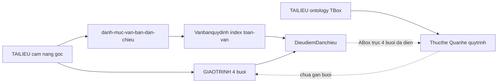

# Vanbanquydinh + ontology so với cẩm nang

> Kết luận: **người dùng** (Obsidian) đủ lối đọc 4 buổi. **Agent:** TBox đúng thiết kế; ABox trục cẩm nang (NQ 15, QĐ 71, TT 57, TT 133, QĐ 61, NĐ 347/254, TT 130/185/157, Điều 44 Luật 89) đã điền 2026-09-02. Không nhét ontology vào lối đọc giáo trình. ~50 số catalog còn boilerplate; bốn VB Wisdom giữ stub.

## Đối tượng và mục đích

Người biên soạn / bảo trì gói (không phải lối đọc hàng ngày của học viên). Trang này trả lời: *catalog + Dieudiem + wiki cẩm nang đã đủ cho công chức chưa; ontology đã đủ để agent trả lời giống cẩm nang chưa*.

Học viên mở buổi: [[GIAOTRINH/cam-nang/00-index|Cẩm nang — 4 buổi]]. TBox: [[TAILIEU/ontology|Ontology TBox]]. Seed Go: [[TIMHIEU/nghien-cuu/index|Nghiên cứu seed (Go)]].

## Khi nào mở trang này

- Cần nhắc lại: wiki cẩm nang *không* thay file gốc TAILIEU; ontology *không* thay Dieudiem.
- Sắp điền ABox (`Thucthe.md` / `Quanhe.md` / `quytrinh.md`) — dùng skill `extract-ontology-danang`; inventory stub bằng `scripts/inventory.py`.
- Agent trả lời lệch cẩm nang — kiểm xem thiếu ABox hay thiếu Điều.
- Đối chiếu ba lớp: giáo trình → Điều → thực thể/quy tắc/quy trình.

## Bản đồ nội dung

### Kết luận nhanh

Ba lớp dữ liệu phục vụ hai đối tượng. Người dùng đi GIAOTRINH → Dieudiem. Agent cần TBox + ABox; ABox hiện lệch mạnh về Luật 89.

| Đối tượng | Lớp dùng | Đủ so với cẩm nang? |
|-----------|----------|---------------------|
| Công chức / giảng viên (Obsidian) | [[GIAOTRINH/cam-nang/00-index\|4 buổi]] + Dieudiem + [[TAILIEU/Cẩm nang quản lý ngân sách xã - 23.8.2026\|file gốc]] | **Đủ** — catalog 64/64 + 4 số Wisdom; wiki map buổi → Điều; không copy bảng tỷ lệ/định mức |
| Agent (trả lời *ai / thẩm quyền / điều kiện / thời hạn* không đọc hết toàn văn) | TBox [[TAILIEU/ontology\|ontology]] + ABox từng số hiệu | **TBox phù hợp; ABox trục 4 buổi đã điền** — Luật 89 + NQ 15 / QĐ 71 / TT 57 / TT 133 / QĐ 61 / NĐ 347·254 / TT 130·185·157. Catalog còn ~50 số boilerplate; 4 VB Wisdom stub |

Ontology cố ý là lớp nghiên cứu — không nằm trên lối đọc giáo trình ([[TAILIEU/index|TAILIEU]], [[TIMHIEU/nghien-cuu/index|nghien-cuu]]). GIAOTRINH không wikilink `Thucthe` / `Quanhe` / `quytrinh` (đúng quy ước). Agent phải tự mở file ABox trong thư mục số hiệu.

### Người dùng — đủ

- Catalog khóa học: [[TAILIEU/danh-muc-van-ban-dan-chieu|Danh mục văn bản dẫn chiếu]] **64/64**; Wisdom bổ sung 4 số ([[Vanbanquydinh/TW/Luat/2015/83-2015-QH13/index|83/2015/QH13]], [[Vanbanquydinh/TW/Luat/2015/81-2015-QH13/index|81/2015/QH13]], [[Vanbanquydinh/TW/Luat/2019/55-2019-QH14/index|55/2019/QH14]], [[Vanbanquydinh/TW/Thong_tu/2026/01-2026-TT-KTNN/index|01/2026/TT-KTNN]]). Bản đồ: [[Vanbanquydinh/index|Vanbanquydinh]].
- Điều đã dẫn HV/CN: file `DieudiemDanchieu/Dieu-NN.md` (khoảng 157 file). Wiki buổi wikilink **ngay chỗ nhắc** tới file Điều, nhãn tên Điều.
- Bốn buổi = một vòng đời NS xã: chỗ đứng → lập DT → điều kiện chi + TSC + kho → khóa sổ / QT / CCTL. Mỗi trang con có **Điều đã dẫn** + **Kỹ năng**; bảng tỷ lệ / định mức mở trên Vanbanquydinh, không chép vào wiki.
- Wiki **không** thay cặp TAILIEU. Toàn văn buổi vẫn ở [[TAILIEU/Cẩm nang quản lý ngân sách xã - 23.8.2026|Cẩm nang]] heading `# BUỔI n`.

### Agent — TBox phù hợp; ABox trục 4 buổi đã điền

TBox tại [[TAILIEU/ontology|ontology]]: `Nguoi` / `ToChuc` / `KhaiNiemChuyenMon` / `QuyTrinh` / `QuyTac`; properties `hasDuty` `hasAuthority` `mustSatisfy` `precedes` `hasDeadline` `governs`; ID `E:` `R:` `P:`. Đủ schema để mã hóa câu hỏi cẩm nang *ai được quyết*, *khoản thuộc xã hay TP*, *chi khi đủ bốn lớp*, *khóa sổ / chuyển nguồn / QT trước hạn*.

ABox **trong từng thư mục** (cùng chỗ `toan-van.md`). Không có mục lục ID xuyên văn bản — agent phải grep 68 bộ file trùng tên (wikilink **full path**).

Số liệu khảo sát 2026-09-02 (block `### E:` / `### R:` / `## P:`); cột «sau điền» = lần triển khai cùng ngày:

| Số hiệu | E | R | P | Ghi chú |
|---------|---|---|---|---------|
| [[Vanbanquydinh/TW/Luat/2025/89-2025-QH15/Thucthe\|89/2025/QH15]] | ~53 | 36 | 6 | Mẫu vàng + `R:DuToan-mustSatisfy-BayCanCuDieu44` |
| [[Vanbanquydinh/TW/Nghi_dinh/2026/73-2026-NĐ-CP/Quanhe\|73/2026/NĐ-CP]] | 1 (không nhân đôi ID Luật 89) | 20 | 6 | Chi tiết thi hành; P: trùng slug Luật 89 |
| [[Vanbanquydinh/TW/Luat/2025/72-2025-QH15/Thucthe\|72/2025/QH15]] | 7 | 4 | 0 | HĐND / UBND / Chủ tịch xã |
| [[Vanbanquydinh/TW/Luat/2017/15-2017-QH14/Thucthe\|15/2017/QH14]] | 23 | 8 | 3 | TSC khung |
| [[Vanbanquydinh/Da_Nang/Nghi_quyet_HDND/2025/15-2025-NQ-HĐND/Thucthe\|15/2025/NQ-HĐND]] | 6 | 5 | 1 | Thu 100% / phân chia / thưởng vượt thu / chi khi trong Điều 6; không dán bảng tỷ lệ |
| [[Vanbanquydinh/Da_Nang/Quyet_dinh_UBND/2026/71-2026-QĐ-UBND/Thucthe\|71/2026/QĐ-UBND]] | 2 | 4 | 2 | `P:lap-gui-du-toan-da-nang` 05/6–15/6; QT cấp I 20/02 / 31/3 |
| [[Vanbanquydinh/TW/Thong_tu/2025/57-2025-TT-BTC/Thucthe\|57/2025/TT-BTC]] | 3 | 3 | 0 | `E:CoQuanTaiChinhCapXa` ≡ `E:PhongKinhTe`; đã gỡ `E:TaiKhoanDuToanKBNN` |
| [[Vanbanquydinh/TW/Thong_tu/2025/133-2025-TT-BTC/Thucthe\|133/2025/TT-BTC]] | 1 | 3 | 0 | 10% TX; nguồn CCTL ≠ dự phòng; tỷ lệ trích SNCL |
| [[Vanbanquydinh/Da_Nang/Quyet_dinh_CT_UBND/2025/61-2025-QĐ-CTUBND/Thucthe\|61/2025/QĐ-CTUBND]] | 4 | 5 | 3 | Nhà đất ≠ máy móc (Điều 4); đã xóa heading `### C3.` trống |
| [[Vanbanquydinh/TW/Nghi_dinh/2025/347-2025-NĐ-CP/Quanhe\|347/2025/NĐ-CP]] | 4 | 4 | 1 | Cửa chi TX qua KBNN; tách NĐ 254 |
| [[Vanbanquydinh/TW/Nghi_dinh/2025/254-2025-NĐ-CP/Quanhe\|254/2025/NĐ-CP]] | (giữ) | 3 | (giữ) | + hồ sơ Điều 8 |
| [[Vanbanquydinh/TW/Thong_tu/2025/130-2025-TT-BTC/Quanhe\|130/2025/TT-BTC]] | 1 | 2 | 0 | Mục lục từ 01/01/2026; xã = cấp 4 |
| [[Vanbanquydinh/TW/Thong_tu/2015/185-2015-TT-BTC/Quanhe\|185/2015/TT-BTC]] | 1 | 2 | 0 | Một mã; đóng mã khi sáp nhập |
| [[Vanbanquydinh/TW/Thong_tu/2025/157-2025-TT-BTC/Thucthe\|157/2025/TT-BTC]] | 2 | 3 | 0 | TK DT ≠ tiền gửi; chữ ký xã; đối chiếu trước chuyển nguồn |
| 4 VB Wisdom (81, 55, 83, 01/2026-TT-KTNN) | 0 | 0 | 0 | Stub «Chưa tách thực thể» — giữ |
| Còn lại (~50 số) | 1–2 | 0–2 | 0–2 | Boilerplate / thực thể lõi |

[[Vanbanquydinh/TW/Van_ban_hop_nhat/2026/89-VBHN-VPQH/Thucthe|89/VBHN-VPQH]] = con trỏ `owl:sameAs` Luật 89 — đúng TBox, không nhân đôi ID.

### Gap agent theo 4 buổi

Wiki buổi đã đủ cho người đọc. Cột dưới là **ABox so với «Nắm để làm» / «Điều đã dẫn»** của từng buổi — sau lần điền 2026-09-02.

| Buổi | Wiki + Dieudiem | ABox agent |
|------|-----------------|------------|
| [[GIAOTRINH/cam-nang/buoi-01/00-index\|Buổi 1]] — chỗ đứng, phân cấp, thẩm quyền | Đủ. §2 mở [[Vanbanquydinh/Da_Nang/Nghi_quyet_HDND/2025/15-2025-NQ-HĐND/DieudiemDanchieu/Dieu-06\|Điều 6]] · [[Vanbanquydinh/Da_Nang/Nghi_quyet_HDND/2025/15-2025-NQ-HĐND/DieudiemDanchieu/Dieu-07\|Điều 7]] · [[Vanbanquydinh/Da_Nang/Nghi_quyet_HDND/2025/15-2025-NQ-HĐND/DieudiemDanchieu/Dieu-11\|Điều 11]] NQ 15. §3 chuỗi HĐND / UBND / Chủ tịch / Phòng KT / đơn vị | **Đã điền.** NQ 15: thu 100% / phân chia / thưởng ≤20% trước 31/01 / chi khi trong Điều 6. TT 57: `E:CoQuanTaiChinhCapXa` ≡ `E:PhongKinhTe`; R: tham mưu, không duyệt chi thay KBNN, `reportsTo` Sở TC. Luật 72 giữ `E:HDNDXa` `E:UBNDXa` `E:ChuTichUBNDXa` |
| [[GIAOTRINH/cam-nang/buoi-02/00-index\|Buổi 2]] — lập / giao / chỉnh DT | Đủ. 7 căn cứ [[Vanbanquydinh/TW/Luat/2025/89-2025-QH15/DieudiemDanchieu/Dieu-44\|Điều 44]] + lịch [[Vanbanquydinh/Da_Nang/Quyet_dinh_UBND/2026/71-2026-QĐ-UBND/index\|QĐ 71]] (05/6 đơn vị, 15/6 xã → STC) | **Đã điền.** `P:lap-gui-du-toan-da-nang` `precedes` `P:lap-giao-du-toan`. `R:DuToan-mustSatisfy-BayCanCuDieu44`. Đã xóa nhận định «không có thời hạn» trên QĐ 71 |
| [[GIAOTRINH/cam-nang/buoi-03/00-index\|Buổi 3]] — chi, TSC, kho | Đủ. Bốn lớp [[Vanbanquydinh/TW/Luat/2025/89-2025-QH15/DieudiemDanchieu/Dieu-12\|Điều 12]]; mục lục / mã / TK; QĐ 61 phụ lục | **Đã điền actor/quy tắc (không nhân phụ lục).** TT 130 cấp 4; TT 185 một mã + đóng mã sáp nhập; TT 157 chữ ký / ĐT≠tiền gửi / đối chiếu; NĐ 347 cửa TX; NĐ 254 hồ sơ Điều 8; QĐ 61 nhà đất ≠ máy móc. `R:ChiNSNN-bonLopKiemSoat` vẫn trên Luật 89 |
| [[GIAOTRINH/cam-nang/buoi-04/00-index\|Buổi 4]] — khóa sổ, QT, CCTL | Đủ. [[Vanbanquydinh/TW/Luat/2025/89-2025-QH15/DieudiemDanchieu/Dieu-66\|Điều 66]]–[[Vanbanquydinh/TW/Luat/2025/89-2025-QH15/DieudiemDanchieu/Dieu-67\|67]] + [[Vanbanquydinh/TW/Thong_tu/2025/133-2025-TT-BTC/DieudiemDanchieu/Dieu-04\|TT 133 Điều 4]] | **Đã điền CCTL.** TT 133: tiết kiệm 10% DT chi TX 2026; nguồn k3 a–g ≠ dự phòng. `P:xu-ly-cuoi-nam` / `P:quyet-toan-dia-phuong` Luật 89 giữ khung |

### Lỗi chất lượng ABox (còn lại)

- Đã sửa: heading dở QĐ 71 / `### C3.` QĐ 61; `E:TaiKhoanDuToanKBNN` về TT 157; QĐ 71 «không có thời hạn».
- [[Vanbanquydinh/TW/Luat/2025/89-2025-QH15/Quanhe|Quanhe Luật 89]]: mục «6. Tài sản công» trống (TSC nằm Luật 15 / QĐ 61) — cố ý.
- Bốn VB Wisdom: stub nguyên văn «Chưa tách thực thể/quy tắc từ toàn văn».
- ID lặp giữa file (ví dụ `E:HDNDXa` trên Luật 89 và Luật 72) — đúng quy ước TBox (*một ID, block thuộc `definedIn` của số hiệu*); agent dễ đếm trùng nếu không canonical.
- YAML `cam_nang_buoi` trên ABox — skill extract gắn khi overlay xác định buổi; file điền trước 2026-09-02 có thể chưa có.

### Ưu tiên đã làm / còn lại

Đã điền trục cẩm nang (không đổ 68 số):

1. NQ 15 — R: nhiệm vụ chi xã, thu 100%/phân chia, thưởng vượt thu; không dán bảng tỷ lệ Điều 7.
2. QĐ 71 — `P:` lịch Đà Nẵng (05/6, 15/6) `precedes` `P:lap-giao-du-toan`; xóa «không có thời hạn».
3. TT 57 — `E:PhongKinhTe` / `E:CoQuanTaiChinhCapXa`; gỡ `E:TaiKhoanDuToanKBNN` (canonical TT 157).
4. TT 133 — R: tiết kiệm 10% TX, nguồn CCTL 2026.
5. QĐ 61 + NĐ 347 / 254 + TT 130 / 185 / 157 — actor/quy tắc buổi 3, không nhân toàn phụ lục.
6. R: bảy căn cứ [[Vanbanquydinh/TW/Luat/2025/89-2025-QH15/DieudiemDanchieu/Dieu-44|Điều 44]] trên Quanhe Luật 89.

Còn lại nếu cần sau: encyclopedia KTNN (bốn số Wisdom — không trừ khi khóa học dẫn Điều); ~50 số catalog. Extract lần sau: skill Cursor `extract-ontology-danang` (một số hiệu / lần; YAML `cam_nang_buoi` khi overlay xác định buổi). Không nhét `[[…/Thucthe]]` vào trang GIAOTRINH.

## Vận dụng

1. **Làm đúng (biên soạn)** — học viên: buổi → Dieudiem → `toan-van` nếu cần bảng. Agent: TBox rồi ABox số hiệu trục 4 buổi; thiếu block trên số catalog khác thì mở Dieudiem, không suy từ stub.
2. **Tự kiểm** — câu «khoản này xã được chi không?» mở `R:NganSachCapXa-chiKhi-TrongDieu6NQ15` hoặc [[Vanbanquydinh/Da_Nang/Nghi_quyet_HDND/2025/15-2025-NQ-HĐND/DieudiemDanchieu/Dieu-06|Điều 6 NQ 15]]; bảng tỷ lệ vẫn mở Dieudiem, không nằm ABox.
3. **Giải trình** — path thư mục số hiệu + Điều; đối chiếu heading TAILIEU `# BUỔI n`. Ontology không phải căn cứ pháp lý.

## Tài liệu chính

- [[TAILIEU/Cẩm nang quản lý ngân sách xã - 23.8.2026|Cẩm nang quản lý ngân sách xã]] — trình tự buổi, phân cấp–chi–quyết toán xã.
- [[TAILIEU/Tài liệu in cho học viên|Tài liệu in cho học viên]] — góc KTNN, 05 chuyên đề, sổ tay tự kiểm.

## Căn cứ

Catalog và Điều: [[TAILIEU/danh-muc-van-ban-dan-chieu|Danh mục văn bản dẫn chiếu]] · [[Vanbanquydinh/index|Văn bản quy định dẫn chiếu]]. TBox: [[TAILIEU/ontology|Ontology TBox]]. Mẫu ABox: [[Vanbanquydinh/TW/Luat/2025/89-2025-QH15/Thucthe|Thucthe Luật 89]] · [[Vanbanquydinh/TW/Luat/2025/89-2025-QH15/Quanhe|Quanhe]] · [[Vanbanquydinh/TW/Luat/2025/89-2025-QH15/quytrinh|quytrinh]].

Phạm vi gói: [[TIMHIEU/nghien-cuu/index|Nghiên cứu seed (Go)]].

## Liên kết

- Hub: [[hub-goi|Hub gói — lối vào nhu cầu]] — lối vào học viên (không phải trang biên soạn).
- Cẩm nang: [[GIAOTRINH/cam-nang/00-index|Cẩm nang — 4 buổi]] — lối đọc người dùng.
- Vanbanquydinh: [[Vanbanquydinh/index|Văn bản quy định dẫn chiếu]] — catalog + Dieudiem.
- TBox: [[TAILIEU/ontology|Ontology TBox]] — schema; ABox trong từng thư mục số hiệu.
- Tìm hiểu: [[TIMHIEU/index|Tìm hiểu — nắm → nghĩ → làm]].
