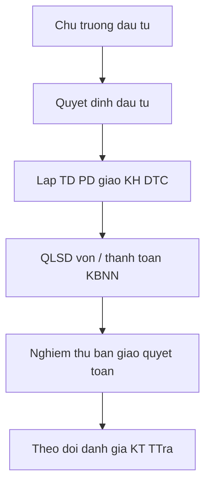

# quytrinh — 79/2026/NQ-HĐND

Phân bổ vốn ĐTC NSĐP 2026–2030. TBox: [[TAILIEU/ontology|ontology]]. Cùng thư mục: [[Vanbanquydinh/Da_Nang/Nghi_quyet_HDND/2026/79-2026-NQ-HĐND/Thucthe|Thucthe]] · [[Vanbanquydinh/Da_Nang/Nghi_quyet_HDND/2026/79-2026-NQ-HĐND/Quanhe|Quanhe]] · [[Vanbanquydinh/Da_Nang/Nghi_quyet_HDND/2026/79-2026-NQ-HĐND/quytrinh|quytrinh]] · [[Vanbanquydinh/Da_Nang/Nghi_quyet_HDND/2026/79-2026-NQ-HĐND/index|79/2026/NQ-HĐND]] · [[Vanbanquydinh/Da_Nang/Nghi_quyet_HDND/2026/79-2026-NQ-HĐND/toan-van|toàn văn]].

## P:chu-ky-dau-tu-cong

- rdf:type: QuyTrinh
- rdfs:label: Chu kỳ kế hoạch đầu tư công
- governs: E:KeHoachDauTuCong, E:ChuTruongDauTu, E:DuAnDauTuCong
- hasAgent: E:ThuTuongChinhPhu, E:ChinhPhu, E:QuocHoi, E:HDNDTinh, E:HDNDXa, E:ChuDauTu, E:CoQuanChuQuanDTC
- source: Luật 58/2024 Điều 4 k18–19, Điều 49–51, 59; NQ 79/2026 Điều 3
- hasDeadline: TTg chỉ thị trước 30/6 năm thứ tư; UBTVQH nguyên tắc phân bổ trước 31/7; TTg thông báo tổng mức vốn trước 31/12 năm thứ tư; QH quyết định kỳ họp thứ nhất khóa mới; UBND giao KH trong 30 ngày sau HĐND

1. **Hoạt động ĐTC (Đ.4.18).** Lập–TĐ–QĐ chủ trương → QĐ đầu tư → lập–TĐ–PĐ–giao–triển khai KH ĐTC → QLSD vốn → nghiệm thu, bàn giao, quyết toán → theo dõi, đánh giá, KT, TTra.
2. **Hai tầng thời hạn (Đ.49).** KH trung hạn 05 năm + KH hằng năm. Ba cấp: quốc gia / Bộ-cơ quan TW / CQĐP. Ba nguồn: NSTW, NSĐP, thu hợp pháp CQNN/ĐVSNCL.
3. **Lịch giao KH trung hạn vốn NSNN (Đ.59).** Chuỗi mốc năm thứ tư–thứ năm nhiệm kỳ QH (chỉ thị TTg → UBTVQH → thông báo vốn → HĐND tỉnh cho ý kiến → QH quyết định → TTg giao → HĐND tỉnh/xã quyết định → UBND giao trong 30 ngày).
4. **Đà Nẵng.** NQ 79/2026 Đ.3: căn cứ NQ UBTVQH và QĐ TTg; thứ tự ưu tiên Đ.3.8 (ĐTC đặc biệt/khẩn cấp → CTMTQG/QTGN → hoàn trả ứng trước → DA hoàn thành chưa đủ vốn → … khởi công mới). Phân 30% chi ĐTPT trong chi cân đối cho xã (Đ.5.1).

## Liên kết

- [[Vanbanquydinh/Da_Nang/Nghi_quyet_HDND/2026/79-2026-NQ-HĐND/Thucthe|Thucthe]] · [[Vanbanquydinh/Da_Nang/Nghi_quyet_HDND/2026/79-2026-NQ-HĐND/Quanhe|Quanhe]] · [[Vanbanquydinh/Da_Nang/Nghi_quyet_HDND/2026/79-2026-NQ-HĐND/quytrinh|quytrinh]]
- TBox: [[TAILIEU/ontology|ontology]] · Hub VB: [[Vanbanquydinh/index|Vanbanquydinh]]
